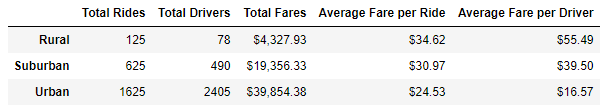

# PyBer_Analysis

## Project Overview

This project is to create a summary of the ride-sharing data by city type by doing the below tasks

- Calculate the Total rides, drivers and total fares by city types (Urban, Suburban and Rural)
- Calculate the Average fare per ride and average fare per driver
- Create a multi-line graph that shows the total fares for each week by city type
- All measures are for the period of Jan,1,2019 to April,29.2019

## Results:

- The total rides for the given period were 2375 for all cities. 
- The rides in urban cities were 68% , in suburban cities were 26% and in rural cities were only 5%.
- To total drivers of urban cities were 81% , in suburban was 16% and in rural was only 3%.
- The average fare per ride was the highest in rural cities ($34.62) followed by suburban and then urban. 
- The average fare per driver was also the highest ($55.49) in rural cities followed by suburban and then urban.
- The total fare for Urban cities came from Urban cities( 63%) followed by suburban cities (30%) and then rural cities (7%)

     
  

## Summary :

### Recomendations:

- Adding more drivers to rural cities are recommended as they are generating the highest average fare per ride and are generating 7% of total fares while their drivers are sitting at only 2% of total drivers. 
- Adding more drivers to suburban areas for the same reasons may generate more revenue. 
- Increase the rates in urban cities even by 5% ( or an average of $1.22 per ride) will generate an increase of $41,803.  
